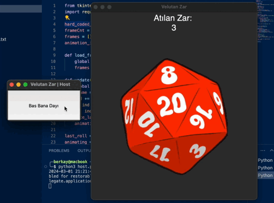

# Velutan Zar

Yayında kullanılan sistemi beğenmedikleri için küçük bir zar uygulaması hazırladım. "Host" zar atabiliyor ve API aracılığıyla çıkan sayı "Client"lere gönderiliyor. Bu çok protatip bir versiyon, istek olursa çok daha geliştirebilirim.

## Kurulum ve Kullanım

Bilgisayarınıza [Python](https://www.python.org/downloads/) yükleyin ve kurulum aşamasında "Add Python to PATH" seçeneğini kesinlikle işaretleyin. `server.json` dosyasını kendinize göre düzenleyin. Serverı başlatın. Eğer aynı ağa bağlı olmayacaksanız port açmalı veya sunucuya yüklemelisiniz, bana ulaşırsanız konuda yardımcı olabilirim. Host olacak kişi `run_host.bat` dosyasını, client olacak kişiler `run_client.bat` dosyasını çalıştırsın. Host butona bastığında bütün clientler zarı görmeli.

## Katkıda Bulunma

Katkılarınızı bekliyoruz! Değişikleri yaptıktan sonra pull request oluşturabilirsiniz.

## Lisans

Bu proje MIT lisansı altında lisanslanmıştır - ayrıntılar için 'LICENSE' dosyasına bakın.

## İletişim

Sorularınız veya diğer sorgularınız için, lütfen [contact@berkay.digital](mailto:contact@berkay.digital) adresine e-posta gönderin.