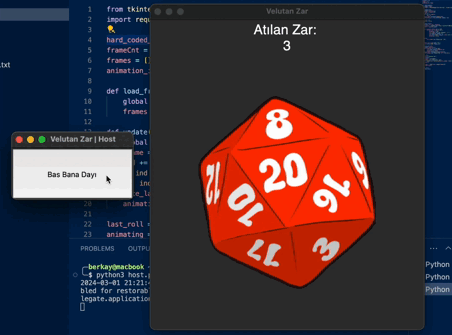

# Velutan Zar

Yayında kullanılan sistemi beğenmedikleri için küçük bir zar uygulaması hazırladım. "Host" zar atabiliyor ve API aracılığıyla çıkan sayı "Client"lere gönderiliyor. Zar animasyonu vb. geliştirilebilir tabii ki, tkinter modülünde animasyonlarla uğraşmak biraz zor olabiliyor.

## Kurulum ve Kullanım

1. Konsola `pip install -r -requirements.txt` yazın.
2. Server dosyasını çalıştırın. `python3 server.py`
3. Host ve Client dosyaları çalıştırsın. `python3 host.py` & `python3 client.py`
4. Host ekranda çıkan butona bastığında bütün Clientler zarı görebiliyor olmalı.

## Katkıda Bulunma

Katkılarınızı bekliyoruz! Değişikleri yaptıktan sonra pull request oluşturabilirsiniz.

## Lisans

Bu proje MIT lisansı altında lisanslanmıştır - ayrıntılar için 'LICENSE' dosyasına bakın.

## İletişim

Sorularınız veya diğer sorgularınız için, lütfen 'contact@berkay.digital' adresine e-posta gönderin.